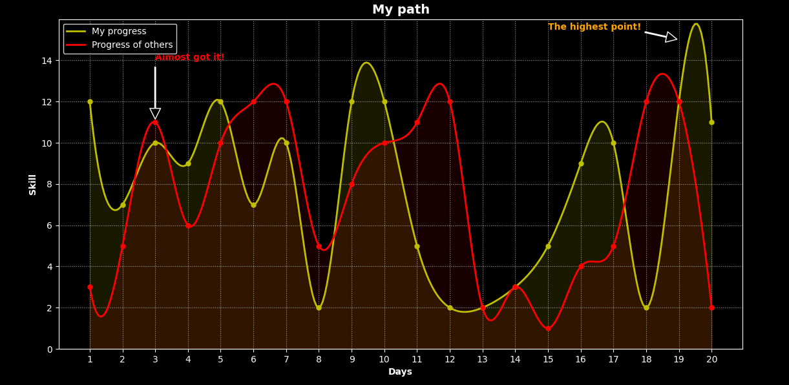

# 🚀 My Data Science project

Hi there! I'm Alex. I am an aspiring Data Scientist. My long-term goal is to master AI logic using **C++**

This repository serves as a showcase of my progress in data visualization and mathematical modeling.

### 📊 Project Overview: Skill Progress Visualization
In this script, I focused on:
* **Data Processing:** Using `NumPy` for handling arrays.
* **Math Modeling:** Applying `SciPy` (Cubic Splines) to transform jagged data into smooth, professional curves.
* **Visualization:** Customizing `Matplotlib` with bold annotations, custom grids, and area fills (`fill_between`).

### 🖼️ Result Preview
 

### 🛠️ Tech Stack
* **Language:** `Python 3.x`
* **Core Libs:** `NumPy`, `Matplotlib`, `SciPy`
* **Future Focus:** `C++`, `Computer Vision`, `Neural Networks`

---
If you like my code, feel free to leave a ⭐!

Code 👇
---

```python

#\\CODE ON LINE PLOT WITH USING MATPLOTLIB, NUMPY, SPLINE//#

# Import libs
import matplotlib.pyplot as plt 
import numpy as np
from scipy.interpolate import make_interp_spline

plt.style.use('dark_background') # Making the style

days = np.array([1, 2, 3, 4, 5, 6, 7, 8, 9, 10, 11, 12, 13, 14, 15, 16, 17, 18, 19, 20]) # Day array
skills = np.array([12, 7, 10, 9, 12, 7, 10, 2, 12, 12, 5, 2, 2, 3, 5, 9, 10, 2, 12, 11]) # Skill array
group_skills = np.array([3, 5, 11, 6, 10, 12, 12, 5, 8, 10, 11, 12, 2, 3, 1, 4, 5, 12, 12, 2]) # Skill of others array

days_smooth = np.linspace(days.min(), days.max(), 300) 
spl_my = make_interp_spline(days, skills, k=3)
spl_group = make_interp_spline(days, group_skills, k=3)

skills_smooth = spl_my(days_smooth)
group_smooth = spl_group(days_smooth)

plt.plot(days_smooth, skills_smooth, 'y', label='My progress', linewidth=2)
plt.plot(days_smooth, group_smooth, 'r', label='Progress of others', linewidth=2)

plt.fill_between(days_smooth, skills_smooth, color='yellow', alpha=0.1) 
plt.fill_between(days_smooth, group_smooth, color='red', alpha=0.1)  

plt.plot(days, skills, 'oy', markersize=5) 
plt.plot(days, group_skills, 'or', markersize=5) 

plt.annotate('The highest point!', # <-- making comment, with parametrs
             xy=(19, 15), 
             xytext=(15, 15.5), 
             arrowprops=dict(facecolor='black', shrink=0.05, width=1), 
             fontsize=10, 
             color='orange',
             fontweight='bold')

plt.annotate('Almost got it!', # <-- making comment with parametrs
             xy=(3, 11),
             xytext=(3, 14), 
             arrowprops=dict(facecolor='black', shrink=0.05, width=1),
             fontsize=10, 
             color='red',
             fontweight='bold')

plt.xlabel('Days', fontweight='bold') # Days (X)
plt.ylabel('Skill', fontweight='bold') # Skill (Y)
plt.title('My path', fontsize=14, fontweight='bold') # Creating title

plt.xticks(days) # borders on X
plt.yticks(np.arange(0, 16, 2)) # borders on Y

plt.legend(shadow=True, loc='upper left') # show the comments, title, labels
plt.grid(True, ls=':', alpha=0.6) # Making grid

plt.ylim(0, 16)

plt.show() # Show the plot

```
